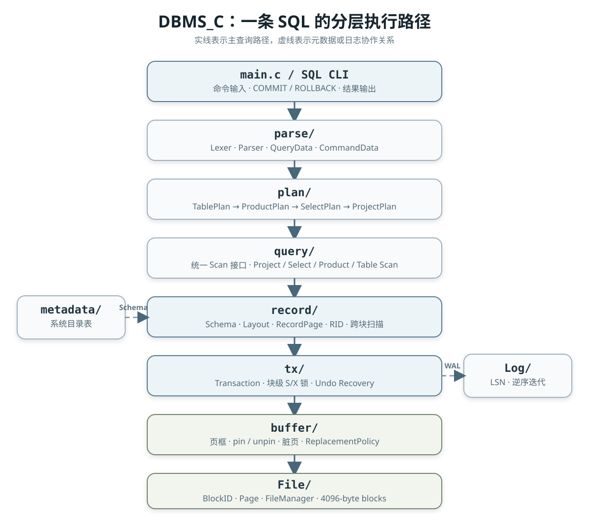

DBMS_C 是我的本科毕业设计，也是我第一次试着把数据库课本上的概念接成一个可以运行的系统。它不是对 MySQL 或 PostgreSQL 的缩小复刻，而是一个教学型关系数据库原型：约 1.37 万行非测试 C 代码，默认使用 4096 字节页面和 8 个缓冲帧，从 SQL 解析一路走到磁盘块读写。

这篇文章不是功能清单。我更想记录的是：当 `Page`、Buffer Pool、日志、锁、记录页和执行计划不再只是名词，它们在代码里怎样互相约束；以及一个“能跑”的课程项目，离一个边界清楚、结果可信的数据库内核还有多远。

## 1. 为什么开始这个项目

数据库原理课能解释 B+ 树、事务和查询优化，却很难让我真正回答一个具体问题：执行一条 `UPDATE` 时，旧值在哪里记录，页面什么时候落盘，`ROLLBACK` 又怎样找到需要撤销的修改？直接阅读成熟数据库又容易淹没在庞大的工程体系里。

于是我选择了一个中间尺度：不用现成存储引擎，自己实现一条最小但完整的链路。项目支持 `CREATE TABLE`、`INSERT`、`SELECT`、`UPDATE`、`DELETE`、视图和索引元数据；查询侧支持投影、`WHERE` 条件以及“笛卡尔积 + 谓词过滤”形式的多表查询。

回头看，C 的价值不只是“更接近底层”。没有对象生命周期、容器和字符串库替我兜底后，我必须明确一个 `Buffer *` 是共享对象还是副本，一个字符串由谁释放，一条日志在字节数组中的偏移如何计算。后来遇到的很多 bug，恰好都来自这些边界没有说清楚。

## 2. 项目整体设计

系统按依赖方向分层，上层只通过事务和扫描接口触碰存储细节。当前真实主链路可以概括为：



`Lib/` 提供 CString、链表、向量、Map、Trie、红黑树和字节缓冲等基础设施；`error/` 和 `trace/` 分别承担错误对象与命令级执行跟踪。核心模块的职责则比较明确：

| 模块 | 在实际代码中的职责 |
| --- | --- |
| `File/` | 用“文件名 + 块号”标识磁盘块，缓存 `FILE *`，按固定块长读写页面 |
| `buffer/` | 管理页框、pin 计数、脏页和 WAL 刷新顺序，提供替换策略接口 |
| `Log/` | 在日志页中追加带 LSN 的变长记录，并按逆序迭代 |
| `tx/` | 为读写加块级 S/X 锁，记录旧值，提交、回滚并释放页面与锁 |
| `record/` | 把 Schema 计算成定长 Layout，在页面内管理记录槽，跨块顺序扫描 |
| `metadata/` | 把表、字段、视图、索引和统计信息也存进普通系统表 |
| `parse/` | 把有限 SQL 文法解析为 `QueryData` 或各类更新命令对象 |
| `plan/` / `query/` | 生成 Plan 树，再打开为统一 Scan 链执行 |
| `index/` | 实现 100 桶哈希索引结构；当前未接入正常查询路径 |

`SimpleDBInit` 把这些模块装配起来。它在 `Show2` 目录下创建数据库，初始化 `SimpleDB.log`，再通过一个事务创建或读取 `tblcat`、`fldcat`、`viewcat` 和 `idxcat`。元数据不是单独的配置文件，而是复用同一套记录页和表扫描机制，这一点让我第一次真正理解了“系统目录本身也是表”。

## 3. 存储层：从字节到记录

最底层的 `BlockID` 只有文件名和块号。`FileManagerRead` 计算 `blockSize * blockNumber` 的偏移，把一整块读入 `Page`；读到文件尾之外时返回全零页。`FileManagerAppend` 则在文件末尾补一个零块。每张表对应一个 `.tbl` 文件，日志使用单独的 `SimpleDB.log`。

`Page` 是 `ByteBuffer` 的薄封装，提供整数、短整数、长整数、原始字节和字符串读写。字符串采用“4 字节长度 + 内容”的形式。上层 `Layout` 根据 Schema 为字段计算固定偏移：每个记录槽开头预留 4 字节状态位，整数占 4 字节，`VARCHAR(n)` 在槽中占 `n + 4` 字节。因此它并不是真正的变长记录组织，而是用固定槽换取更简单的寻址。

`RecordPage` 把页面解释成连续的槽：状态为 `EMPTY` 或 `USED`，插入就是寻找下一个空槽，删除只是把状态改回空闲。`TableScan` 在当前页找不到下一条已用记录时移动到下一个块；插入无空槽时追加并格式化新块。RID 由块号和槽号组成。

缓冲层的关键对象是 `Buffer`。它保存一个 Page、对应 BlockID、pin 次数、最后修改它的事务号和 LSN。页面换入时，`BufferAssignToBlock` 先刷新旧脏页，再读入目标块。事务通过 `BufferList` 记录自己固定过的页，提交或回滚后统一 unpin。

这里已经实现了 WAL 的核心顺序：`TransactionSetInt` / `TransactionSetString` 先把旧值写入 undo 日志，得到 LSN，再修改内存页并把页标脏；`BufferFlush` 在写数据页之前调用 `LogManagerFlushLSN`。这不是一句“支持日志”就能概括的，真正重要的是日志必须先于它保护的数据页持久化。

项目中有 `ReplacementPolicy` 抽象和 LRU 双向链表 + 哈希表实现，但当前集成仍不完整：`BufferManagerChooseUnPinnedBuffer` 会线性返回第一个未固定帧，只有找不到未固定帧时才调用 `evict`；而所有帧都被固定时，LRU 也无法合法淘汰。也就是说，现有代码具备 LRU 数据结构，却没有真正让 LRU 决定可淘汰帧。这是“模块存在”和“策略生效”之间很典型的差别。

## 4. 事务、日志与并发控制

每个事务有递增的事务号、自己的 `BufferList` 和 `ConcurrencyManager`，但共享同一组 FileManager、LogManager、BufferManager 和全局锁表。读取块前申请 S 锁，写入前申请 X 锁；若事务已经持有 S 锁，则尝试升级。锁直到 `COMMIT` 或 `ROLLBACK` 时才整体释放，这个思路接近严格两阶段锁，但粒度是整个块，不是记录。

日志页的组织方式很有意思：偏移 0 保存 boundary，新记录从页尾向前生长。每条记录包含长度和 LSN，payload 中再保存操作类型、事务号、块、偏移和旧值。迭代器从当前 boundary 向页尾读取，所以天然得到从新到旧的顺序。

`COMMIT` 会刷新该事务修改的缓冲页，写入 COMMIT 记录并刷日志；`ROLLBACK` 则反向扫描日志，只撤销当前事务的 `SETINT` / `SETSTRING`，直到遇到它的 START 记录。撤销写回旧值时关闭再次记日志，随后刷新页面、写 ROLLBACK 记录并释放锁和 pin。

代码里还存在 `TransactionRecover`：它会反向扫描日志，跳过已经提交或回滚的事务并撤销其他修改，最后写 checkpoint。但 `SimpleDBInit` 在打开旧数据库时只打印 `recovering existing database`，并没有调用这个入口。因此当前可信的能力是显式事务回滚，不是进程重启后的自动崩溃恢复。

并发控制也要保持同样的克制描述。锁表能够表达 S/X 状态，`DeadlockDetector` 也实现了等待图和三色 DFS，但检测器没有接入锁申请主流程。锁冲突采用最多约 1 秒的忙等，错误没有一路返回到 SQL 层，锁表自身也没有线程同步。命令行虽有创建、显示和切换事务的代码，`main.c` 的 `switch` 分支却没有接住 `TransactionManagerSwitch` 的返回值。它更像并发控制实验骨架，而不是已经验证过的多线程事务系统。

## 5. 一条 SQL 怎样执行

以这条查询为例：

```sql
SELECT id, name FROM student WHERE age > 21;
```

执行链不是直接从 Parser 调用存储层，而是分成“描述查询”和“消费记录”两步：

```text
SQL 字符串
  -> Lexer / Parser
  -> QueryData(fields, tables, predicate)
  -> ProjectPlan(SelectPlan(TablePlan))
  -> ProjectScan(SelectScan(TableScan))
  -> Transaction -> Buffer -> File
```

Lexer 识别关键字、标识符、整数、字符串和比较运算符；Parser 生成字段列表、表列表和由 Term 组成的 Predicate。`BasicQueryPlanner` 为每张表创建 `TablePlan`，多表时按 FROM 顺序用 `ProductPlan` 串成笛卡尔积，再统一包上 `SelectPlan` 和 `ProjectPlan`。`SELECT *` 会在规划阶段根据 Schema 展开成真实字段列表，视图则从 `viewcat` 取回定义后递归规划。

Plan 描述“要做什么”和代价估计，`open` 后得到的 Scan 才真正产出记录。`SelectScanNext` 不断推进下层 Scan，直到谓词成立；`ProjectScan` 限制可见字段；`ProductScan` 用嵌套循环枚举两侧记录。更新语句走 `BasicUpdatePlanner`：DELETE 和 UPDATE 都构造 `TablePlan + SelectPlan`，INSERT 打开 TableScan 后插入一条槽记录。

仓库中还有 `BetterQueryPlanner`，实现了谓词下推思路、简单连接成本估计和贪心连接顺序；统计信息也能返回块数、记录数以及粗略的不同值数量。不过 `SimpleDBInit` 实际注入的是 `BasicQueryPlanner`，`OptimizedProductPlan.c` 还是空文件，所以这些优化目前属于实验代码，不能算默认执行能力。

## 6. 开发过程中真正踩过的坑

Git 历史保留了 65 次提交，也保留了一些很诚实的阶段状态。2024 年 11 月 13 日的一条提交直接写着：“BufferList 中得到的东西修改后，BufferManager 中不能看到”。原因是 Map 里保存了 `Buffer` 的值副本。事务改的是副本，而缓冲池持有另一个对象。后续补丁把映射值改成包装 `Buffer *` 的 `BufferTEMP`，让两边指向同一个页框。这个问题让我意识到：在 C 里，数据结构选择不仅是查找复杂度，还决定对象身份是否被保留。

第二个问题更隐蔽。早期 `BufferInit` 会根据传入参数重新创建 FileManager 和 LogManager。表面上每个 Buffer 都“拥有完整依赖”，实际上它们打开了不同的管理器实例，日志状态、文件句柄和外部事务看到的状态并不一致。11 月 14 日的修复只有两行：不再重新初始化，直接保存传入指针。改动很小，但它修正的是整个系统的共享状态模型。

Rollback 也不是一次写对的。历史提交先明确记录“Rollback 还存在一定问题”，随后逐步修正日志迭代条件、事务号函数指针、字符串日志长度和偏移计算，还修掉了 SETSTRING 记录误写成 SETINT 类型的问题。调试时又在文件写入后增加 `fflush`，避免进程内读回仍看见旧状态。最后的解决方案不是在回滚函数里继续加判断，而是把“日志怎样序列化、怎样逆序读取、怎样定位旧值”逐层校准。

项目到 2026 年归档时又暴露了另一类问题：它在原开发环境里能跑，却不等于新的 clone 能构建。发布整理提交补回了 CMake 引用但未跟踪的 CList、错误模块、测试和 demo 文件；移除了被替代的 List；修正带空格的文件名和测试文件拼写；清理误提交的数据库二进制产物，并恢复批量格式化破坏的中文注释。对我来说，这部分工作同样属于数据库开发：可复现构建、干净仓库和可信测试不是包装，而是工程本身。

## 7. 测试和验证

项目使用 CMocka，并通过 CMake 注册了 25 个 CTest 测试套件，覆盖基础容器、文件、日志、缓冲区、事务、回滚、锁、记录、解析、计划、更新、元数据和哈希索引。按当前注册源文件统计，共有 105 个 CMocka 用例进入这 25 个套件。

我在全新临时副本中重新执行了：

```powershell
cmake -S . -B build -G "MinGW Makefiles"
cmake --build build -j 4
ctest --test-dir build --output-on-failure
```

结果为 25/25 全部通过，总测试时间 4.49 秒。随后又实际执行了仓库中的 `demo/demo.sql`：3 条学生记录写入成功，`age > 21` 返回 wang 和 zhang；学生与成绩表的多表查询返回两行；UPDATE、DELETE、视图查询和 COMMIT 也得到预期结果。

不过测试数量不能掩盖测试深度。RecoveryBasicTest 目前只验证整数旧值能够 rollback；并发测试验证的是锁状态转换和释放后重新加锁，没有多线程竞争；HashIndexTest 只检查结构和成本公式，没有覆盖真实插入、查找与删除。因此“25 个套件全绿”证明当前主路径可复现，不等于事务、索引和并发边界已经被充分验证。

## 8. 项目总结：完成了什么，还缺什么

DBMS_C 最有价值的结果，不是实现了多少条 SQL，而是打通了这条因果链：字段如何进入 Schema，Schema 如何变成槽偏移，TableScan 如何跨页，事务如何 pin 页面，旧值如何进入日志，脏页为什么必须在日志之后落盘，Plan 又怎样变成逐条产出记录的 Scan。

它与真实数据库的差距也很清楚：

- 只有单机命令行，没有网络协议、权限、会话隔离和真正的多客户端并发；
- 数据类型和 SQL 文法有限，没有 NULL、约束、聚合、排序、子查询等能力；
- 哈希索引未接入建表后的数据维护和查询执行，`CREATE INDEX` 当前只登记元数据；
- 默认计划器不做谓词下推或基于代价的连接排序，统计信息还是 `1 + rows / 3` 这样的估算；
- 没有启动崩溃恢复，锁冲突和死锁处理也没有闭环；
- 内存所有权、错误传播、资源销毁和跨平台支持仍不统一，目前验证环境是 Windows + MinGW。

如果继续沿这个项目演进，我会先修正缓冲替换器的候选集语义，让 LRU 真正参与换页；再把恢复入口接到启动流程，用“写入后强制终止进程”的测试验证 WAL；随后让哈希索引参与 INSERT/DELETE 和等值查询计划；最后才是更完整的优化器与并发执行。在这些基础设施可靠之前，继续增加 SQL 语法只会扩大不确定性。

从零写数据库最直接的收获，是我不再把数据库看成一组孤立算法。它是许多局部规则共同维持的不变量：同一页框必须保持对象身份，日志必须先于数据页，锁的生命周期必须覆盖事务，计划的估算必须和执行算子对应。DBMS_C 还很小，也有明显缺口，但这些缺口本身构成了这次项目复盘最真实的部分。

---

## 相关内容

- 项目主页：[DBMS_C · 教学型 C 语言关系数据库原型](/projects/dbms-c/)
- 开发系列：[从零实现 DBMS_C](/series/dbms-c-from-zero/)——1 篇系列导读 + 12 篇正文，按内核依赖顺序逐层展开
- 系列导读：[从零实现 C 语言数据库内核：DBMS_C 系列导读](/articles/engineering/dbms-c-series/)
- 源码仓库：[github.com/yaohuayuan/DBMS_C](https://github.com/yaohuayuan/DBMS_C)
