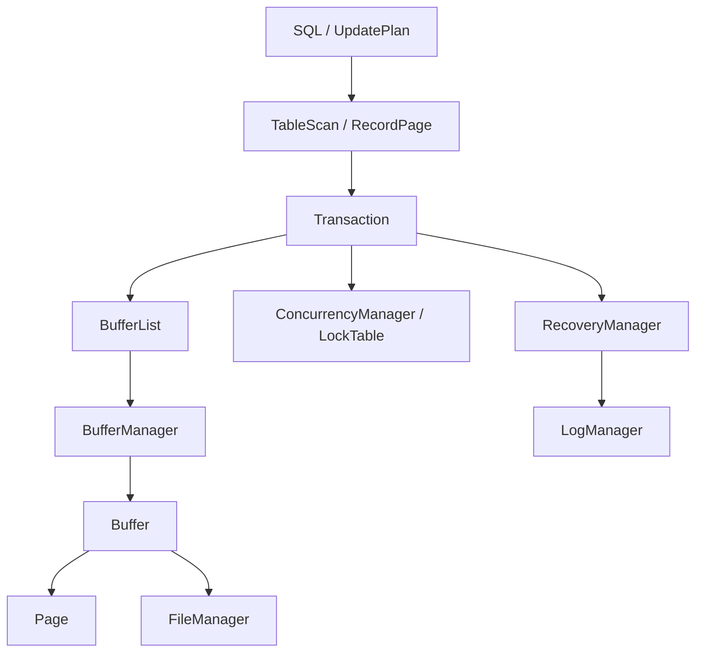
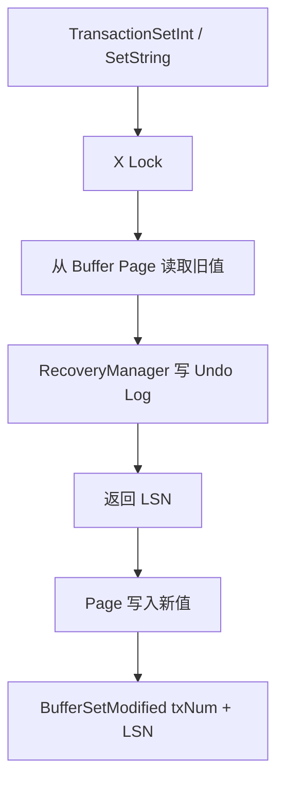

做到 RecordPage 时，字段偏移已经可以算出来，Buffer Pool 也能把目标页面留在内存里。如果上层直接拿到 `Buffer->page` 调用 `PageSetInt`，数据同样会改变。但这样的修改只是一次内存写入，还不能称为事务操作：它没有先拿锁，没有保存旧值，也没有在结束时统一刷新、释放锁和归还页框。

DBMS_C 的 `Transaction` 就是为了解决这个边界问题。它不是一个庞大的事务调度器，而是上层存储操作的统一门面。RecordPage 和 TableScan 只把“哪个块、哪个偏移、什么值”交给 Transaction，由它把 BufferManager、ConcurrencyManager 和 RecoveryManager 串起来。

## Transaction 自己没有保存记录数据

当前结构体主要保存共享管理器和事务私有状态：

```c
typedef struct Transaction {
    TransactionStatus code;
    RecoveryManager *recoveryManager;
    ConCurrencyManager *conCurrencyManager;
    BufferManager *bufferManager;
    FileManager *fileManager;
    int txNum;
    BufferList *bufferList;
} Transaction;
```

初始化时，事务引用数据库唯一的 FileManager 和 BufferManager，再创建属于自己的 RecoveryManager、ConcurrencyManager 与 BufferList。RecoveryManager 会立刻向日志追加一条 START 记录。

这里的职责划分是我后来才逐渐想清楚的：Page 保存字节，Buffer 保存页框状态，Transaction 不复制它们，只负责控制一次操作以什么顺序穿过这些对象。

上层调用链可以概括为：



如果 RecordPage 绕过 Transaction 直接访问 Page，图右侧的锁和日志分支就完全不会发生。这是“能写入”和“按事务路径写入”的差别。

## 为什么 pin/unpin 要由事务统一管理

RecordPage 创建时调用 `TransactionPin`。Transaction 本身只是转发到 BufferList，BufferList 再向 BufferManager 申请页框，并同时记录两份信息：

1. `BlockID string → Buffer *` 的 Map，供后续 get/set 快速找到页框；
2. 当前事务 pin 过的 BlockID 链表，供 commit 或 rollback 时批量 unpin。

```c
void BufferListPin(BufferList *bufferList, BlockID *blockId) {
    Buffer *buffer = BufferManagerPin(
        bufferList->bufferManager, blockId
    );

    BufferTEMP *entry = BufferTEMPInit();
    entry->buffer = buffer;
    map_set(bufferList->buffers,
            CStringGetPtr(BlockID2CString(blockId)),
            *entry);

    /* 再把 BlockID 追加到 pin 链表 */
}
```

Map 解决“从块找到页框”，链表解决“一个事务结束时到底要归还哪些 pin”。对同一个块重复 pin，链表会保留多次记录，因此 `BufferListUnpinAll` 也会按次数调用 BufferManagerUnpin。

这个设计没有使用 RAII，C 里也没有作用域结束自动清理。把资源释放集中在事务结束路径，至少能避免每个 TableScan 都自己猜测整个事务何时完成。

## getInt / getString 的真实调用链

读取并不是直接查 Buffer。`TransactionGetInt` 先申请块级 S 锁，再从当前事务的 BufferList 取得已经 pin 的 Buffer，最后读取 Page：

```c
int TransactionGetInt(Transaction *tx,
                      BlockID *blockId,
                      int offset) {
    ConCurrencyManagerSLock(tx->conCurrencyManager, blockId);
    Buffer *buffer = BufferListGetBuffer(tx->bufferList, blockId);
    return PageGetInt(buffer->page, offset);
}
```

字符串路径相同，只是最后调用 `PageGetString`。这段代码隐含一个没有写进类型系统的前置条件：目标块必须先 pin。BufferList 查询失败时没有返回错误，随后会直接解引用 NULL。

完整的读路径是：

```text
TableScanGetInt
  → RecordPageGetInt
    → TransactionGetInt
      → ConCurrencyManagerSLock
      → BufferListGetBuffer
        → Buffer->Page
          → PageGetInt(offset)
```

FileManager 不一定在这次读取中出现。如果页面已经在 Buffer Pool，读取止于内存；只有 pin 未命中时，BufferManager 才让 FileManager 把块读进页框。

## setInt / setString 为什么要先记旧值

写路径比读路径多了恢复分支。`TransactionSetInt` 的顺序很明确：

```c
ConCurrencyManagerXLock(tx->conCurrencyManager, blockId);
Buffer *buffer = BufferListGetBuffer(tx->bufferList, blockId);

int lsn = -1;
if (okToLog) {
    lsn = RecoverySetInt(
        tx->recoveryManager, buffer, offset, val
    );
}

PageSetInt(buffer->page, offset, val);
BufferSetModified(buffer, tx->txNum, lsn);
```

`RecoverySetInt` 的 `newVal` 参数实际上没有参与日志内容。它先从 Buffer 的 Page 读出旧值，再把事务号、BlockID、offset 和旧值写入 SETINT 日志。完成日志追加后，Transaction 才写新值并把返回的 LSN 交给 Buffer。

因此写操作的核心链路是：



`okToLog = false` 用在页面格式化和 undo 自身。否则 rollback 在恢复旧值时又生成一条新的旧值日志，扫描就可能不断撤销“撤销操作”。当前代码没有补偿日志记录，所以 undo 直接写回但不再次记录。

## commit 实际做了什么

TransactionCommit 不是只改一个状态枚举：

```c
void TransactionCommit(Transaction *transaction) {
    TransactionTraceCommit(transaction);
    RecoveryCommit(transaction->recoveryManager);
    ConCurrencyManagerRelease(transaction->conCurrencyManager);
    BufferListUnpinAll(transaction->bufferList);
    transaction->code = TX_TRANSACTION_COMMIT;
}
```

`RecoveryCommit` 先调用 `BufferManagerFlushAll(txNum)`，把该事务标记过的 Buffer 写回；每个 Buffer 刷新前会根据自己的 LSN 先刷新日志。随后 RecoveryManager 追加 COMMIT 记录并刷新日志页。

所以当前策略更接近“提交时强制写出本事务脏页”，而不是成熟系统中由后台刷页、pageLSN 和恢复协议共同支撑的 no-force 方案。它容易验证：提交返回后，测试直接通过 FileManagerRead 能读到新值；代价是提交路径同步做更多 I/O。

最后，事务释放自己记录的全部 S/X 锁，再把所有页框 unpin，并把状态改成 COMMIT。当前代码没有阻止提交后的 Transaction 继续被调用，状态更多用于展示，而不是严格的生命周期守卫。

## rollback 实际做了什么

rollback 首先从最新日志开始反向扫描，只处理 `txNum` 与当前事务相同的记录。遇到 SETINT 或 SETSTRING 就调用对应 undo，把日志里的旧值写回；遇到本事务 START 就停止。

之后它刷新 undo 修改过的 Buffer，追加 ROLLBACK 记录并刷新日志，最后由 Transaction 释放锁、unpin 页框、更新状态。

```text
TransactionRollback
  → RecoveryDoRollback
    → LogIterator 从新到旧扫描
    → 匹配当前 txNum
    → SET* Undo（okToLog = false）
    → 遇到 START 停止
  → BufferManagerFlushAll
  → 写入并刷新 ROLLBACK
  → release locks
  → unpin all
```

这条路径能解释显式 rollback，但不能自动推出崩溃恢复已经完成。进程在 undo 中途崩溃时没有 CLR 帮助重复恢复，启动流程也没有自动调用 `TransactionRecover`。这些边界会在下一篇专门拆开。

## 一个结构体副本怎样破坏整个事务

2024 年 11 月 13 日的提交说明里出现过一句非常直接的话：“BufferList 中得到的东西进行修改后，BufferManager 中不能看到。”

问题来自 Map 最初按值保存 `Buffer`。事务从 Map 取得的是结构体副本，而 BufferManager 的池里是原对象。事务修改副本中的 Page 或脏页状态后，`BufferManagerFlushAll` 遍历原页框，自然看不到同一份状态。

真正的修复落在稍后的提交 `542b045`：Map 的值改成 `BufferTEMP`，其中只放一个 `Buffer *`。包装结构仍会被 Map 复制，但指针指向 BufferManager 中唯一的页框。

这不是一个局部容器 bug。它会让事务误以为已经记录并修改了页面，让恢复管理器拿到一个状态，让 BufferManager 刷新另一个状态。上一篇 Buffer Pool 已经从页框身份解释过它；从事务角度看，这次问题让我意识到四条链路必须在同一个 Buffer 对象上汇合：

- BufferList 用它完成事务内定位；
- ConcurrencyManager 保护它对应的 BlockID；
- RecoveryManager 读取它的旧值；
- BufferManager 根据它的 txNum 和 LSN 刷新。

第二天的提交 `3267ef6` 又修了相似问题：Buffer 曾经自己新建 FileManager 和 LogManager，后来改为直接引用外部共享实例。对象“看起来内容相同”并不等于它们拥有同一份系统状态。

## TransactionManager 不等于完整调度器

仓库里还有一个 `TransactionManager`，用 Map 按事务号保存 Transaction，可以 Add、Display、Switch，并遍历执行 Commit 或 Rollback。它更像命令行多事务实验的注册表，不负责隔离级别、调度、生命周期回收或持久化事务表。

事务号来自 `Transaction.c` 中的进程内静态整数 `nextTxNum`。它不是原子变量，程序重启后从头开始，也不会与日志中已有事务号做去重。因此它足够区分一次运行中的顺序事务，却不是可持久化的事务 ID 分配器。

## 当前事务模型的边界

把 Transaction 放进主路径后，DBMS_C 已经能让一次记录修改同时经过 Buffer、块级锁和 undo 日志。但它仍是教学型简化实现：

- 锁粒度是 BlockID，不是行，也没有隔离级别配置；
- 锁冲突使用循环等待和超时，没有条件变量，错误也没有传回 SQL 层；
- DeadlockDetector 虽然有代码，但 ConcurrencyManager 没有调用它；
- `nextTxNum` 非线程安全且不持久化；
- BufferList、Transaction 和各子管理器缺少统一 destroy，大量临时字符串和节点所有权不清；
- commit 强制刷新数据页，吞吐和恢复模型都比成熟数据库简单；
- rollback 没有 savepoint、CLR 和崩溃中断后的可重复 undo；
- 单个 Buffer 只保存一个 `txNum`，不足以表达复杂的并发修改历史。

现有事务基础测试证明了初始化状态、pin/unpin 对可用页框数量的影响，以及整数写入在 commit 后能从文件读回。另一个 rollback 测试证明 SETINT 可以恢复旧值。它们没有证明高并发下的隔离性，也没有证明字符串 undo 或进程崩溃后的恢复。

现在回头看，Transaction 最有价值的地方并不是它实现了多少 ACID 特性，而是它给项目建立了一条不能随便绕开的写入路径：上层只描述要读写的块和偏移，事务负责把锁、旧值日志、页修改和页框生命周期按顺序接起来。下一篇要复盘的，正是这条路径里最难调试的部分——为什么日志明明写了，ROLLBACK 仍然可能不对。

[上一篇：一条记录在页面里长什么样](../04-record-storage/) · [下一篇：Undo 日志与恢复机制复盘](../06-log-and-recovery/) · [返回系列导读](../)
