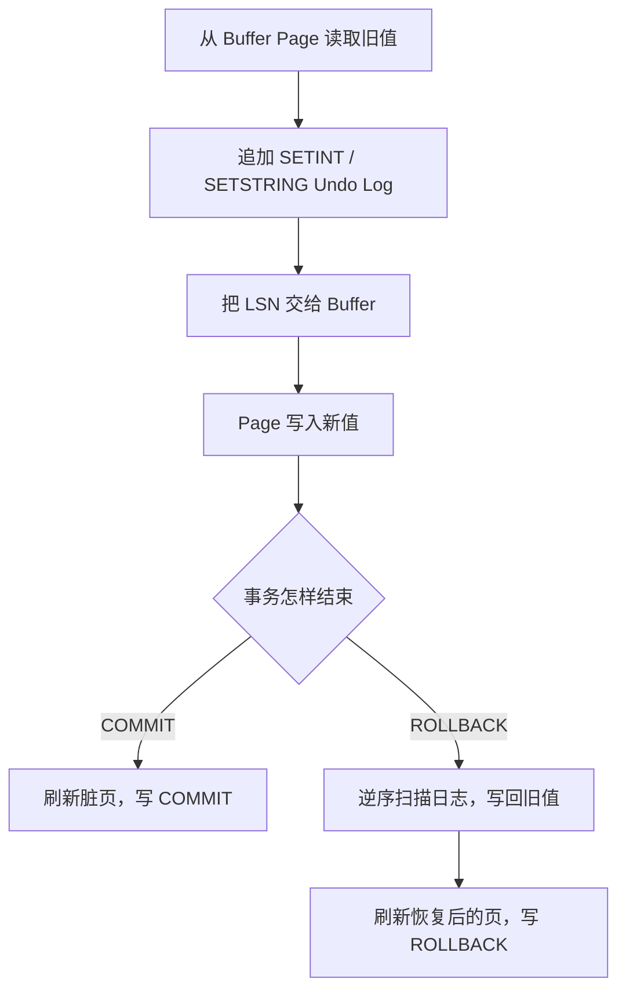

DBMS_C 的 Git 历史里，有一条 2024 年 11 月 13 日的提交写着：“通过测试对文件进行修改，目前来说 Rollback 还存在一定问题。”

这句话比“实现了事务恢复”更能代表当时的状态。日志模块并不是写完几个 START、COMMIT 结构体就自然工作。一个操作码写错、一个字符串长度少算 4 字节、一个 Buffer 被复制、一次文件写入还停在 stdio 缓冲区里，都可能表现为同一个结果：调用了 rollback，值却没有回去。

这一篇不把 DBMS_C 包装成完整恢复系统。我只沿着当前代码和几次关键提交，解释显式事务 rollback 是怎样被做通并得到验证的，以及代码离真正的 crash recovery 还有多远。

## 日志页为什么从尾部向前写

当前 LogManager 把日志文件也交给 FileManager，以同样的固定块大小管理。每个日志页的 0 偏移保存一个 `boundary`，表示有效日志区域从哪里开始：

```text
offset 0                                         blockSize
+-----------+-------------------+---------------------------+
| boundary  |      free         | newest | ... | oldest    |
+-----------+-------------------+---------------------------+
                            ^
                         boundary
```

新页创建时，boundary 等于 blockSize，说明页面还没有日志。追加记录时先计算：

```c
uint32_t recordSize = sizeof(LogRecordHeader) + payloadSize;
int pos = boundary - recordSize;
```

然后把 header 和 payload 写到 `pos`，最后把 boundary 更新为 pos。新记录因此总在旧记录前面，页面内地址从小到大正好对应“新到旧”。

每条记录外层还有一个固定 header：

```c
typedef struct {
    uint32_t length;
    uint32_t lsn;
} LogRecordHeader;
```

`length` 让迭代器知道下一条记录在哪里，`lsn` 是单调递增的日志序列号。当前 header 通过原始结构体字节写入，没有显式编码字节序或结构体布局，跨平台文件格式仍有风险。

如果当前页剩余空间小于“记录大小 + boundary 自身的 4 字节”，LogManager 会先刷新旧页，再追加一个新块。日志记录不会跨页拆分；单条记录大于一页时也没有明确错误路径。

## 逆序迭代不是额外排序

LogIterator 从最后一个日志块开始，把 `currentPos` 设为 boundary。读取 header 和 payload 后执行：

```c
it->currentPos += header.length;
```

因为最新记录就在 boundary，向页尾移动自然得到更旧的记录。走到 blockSize 后，迭代器把块号减一，读取前一个日志块，再从它的 boundary 开始。

所以整个顺序是：最后一块的最新记录 → 同页更旧记录 → 前一块的最新记录。LogManagerBasicTest 连续写入 `first`、`second`、`third`，迭代结果明确断言为 `third`、`second`、`first`；另一个用例关闭并重新初始化 LogManager 后，仍能按逆序读到已经刷新的记录。

这套页布局和 Undo 很匹配。rollback 需要先撤销事务最后一次修改，再撤销更早的修改，不需要把所有日志读进数组后再倒序。

## LSN 在当前实现中做了两件事

LogManager 每次 append 都增加 `latestLSN`，并把 LSN 写入记录 header。Buffer 在修改后保存这次日志返回的 LSN。脏页刷新时执行：

```c
if (buffer->lsn >= 0)
    LogManagerFlushLSN(buffer->logManager, buffer->lsn);

FileManagerWrite(buffer->fileManager,
                 buffer->blockId,
                 buffer->page);
```

这维持了 DBMS_C 当前最重要的 WAL 顺序：描述旧值的日志先进入日志文件，修改后的数据页才写入数据文件。即使 Buffer 因替换而在 commit 前写出，也至少不会让数据页先于自己的 undo 信息落盘。

不过 `LogManagerFlushLSN` 并不真的只把文件刷到某个 LSN。日志以整页写入，函数实际会把当前日志页全部交给 FileManagerWrite，然后把 `LastSavedLSN` 记成请求值；同一页中比该值更新的记录也会一起写出。再加上底层只有 `fflush`、没有 `fsync`，这里验证的是程序正常运行时的写入顺序，不是断电持久化保证。

## 五种主要日志记录保存了什么

RecoveryManager 初始化时写 START；事务修改时写 SETINT 或 SETSTRING；结束时写 COMMIT 或 ROLLBACK。当前枚举中还有 CHECKPOINT，但它只在手动 recovery 路径末尾写入，尚未形成完整检查点协议。

主要记录的 payload 可以概括为：

| 类型 | 当前保存内容 | rollback 时的作用 |
| --- | --- | --- |
| START | opcode、txNum | 标记该事务日志的扫描终点 |
| SETINT | opcode、txNum、文件名、块号、offset、旧整数 | 把旧整数写回原位置 |
| SETSTRING | opcode、txNum、文件名、块号、offset、旧字符串 | 把旧字符串写回原位置 |
| COMMIT | opcode、txNum | 表示事务正常结束 |
| ROLLBACK | opcode、txNum | 表示事务已经显式撤销 |

这些是 undo log，不保存整数的新值。`RecoverySetInt` 虽然接收 `newVal`，实现中真正序列化的是修改前从 Page 读取的 `oldVal`。

一次记录字段修改的顺序因此是：



## rollback 怎样找到“属于我的旧值”

`RecoveryDoRollback` 创建逆序 LogIterator，然后逐条解析 `LogRecord`。只有记录事务号等于当前 `txNum` 时才处理；遇到本事务 START 立即返回，其余记录通过函数指针调用各自 undo：

```c
if (logRecord->LogRecordTxNum(logRecord) == rm->txNum) {
    if (logRecord->LogRecordOP() == LogRecordCode_START)
        return;

    logRecord->LogRecordUnDo(rm->transaction, logRecord);
}
```

SETINT undo 会 pin 日志中的 BlockID，调用 `TransactionSetInt(..., false)` 写回旧值，再 unpin。`false` 表示本次恢复不生成新 undo 日志。SETSTRING 的设计相同。

扫描完成后，`RecoveryRollback` 刷新这个事务标记过的 Buffer，写入 ROLLBACK 并刷新对应日志。它没有生成 compensation log record，因此“undo 到一半再次崩溃”不具备 ARIES 那样的可重复恢复语义。

## 第一次问题：SETSTRING 被写成了 SETINT

2024 年 11 月 13 日的提交 `6ae4c81` 增加了字符串日志写入函数，但第一版有两个直接错误：

```c
int recLen = vpos + sizeof(int);
PageSetInt(page, 0, LogRecordCode_SETINT);
```

它既按一个整数计算结尾长度，又把操作码写成 SETINT。日志解析器看到这条记录后会进入 SetIntRecord 分支，用整数格式解释后面的字符串字节。问题并不在 undo 算法，而在日志从写入的第一刻就已经失去类型。

同日稍后的 `542b045` 把操作码改成 SETSTRING，并改用字符串的页面长度计算记录大小。这次提交还修正过解析时的字段位置：页面字符串不是 `strlen + 1`，而是 4 字节长度前缀加实际内容，所以块号位置必须按 `PageMaxLength(filename)` 计算。

这类 offset bug 很难靠打印一条字符串发现。txNum、文件名、块号、字段 offset 和旧值是连续排列的，只要前一个字段长度错 3 或 4 字节，后面每个整数都可能还能被“读出来”，只是值完全错误。

## 当前 SETSTRING 路径仍然不能写成“已经验证”

源码后来在 2025 年重新整理为 CString 接口，SETSTRING 操作码目前是正确的，解析 filename 后计算块号、offset 的位置也使用 `PageMaxLength(filename)`。但现版本 `SetStringRecordWriteToLog` 又留下了一个长度问题：

```c
int recLen = vpos + PageMaxLength(blockId->fileName);
Page *page = PageInit(recLen + 5);
PageSetString(page, vpos, val);
return LogManagerAppend(logManager, page->buffer->data, recLen);
```

记录末尾应该根据旧值 `val` 计算，这里却再次使用文件名长度。`PageInit(recLen + 5)` 和最终只 append `recLen` 也没有形成清晰契约。文件名和旧字符串恰好接近时可能看不出问题，旧字符串更长时则可能越界或被截断。

因此我不能把当前字符串 rollback 和整数 rollback 写成同一完成度。代码中有 SETSTRING undo 路径，历史上也确实修过错误操作码，但现有 `RecoveryBasicTest` 只验证 SETINT：先提交 111，再在新事务中记录日志改成 222，执行 rollback，最后绕过 Buffer 直接从文件读回 111。当前测试没有对字符串旧值做同样断言。

## 第二次问题：事务和 BufferManager 看见的不是同一个 Buffer

日志序列化修好后，rollback 仍然可能“不工作”。原因在上一篇提过：BufferList 最初按值保存 Buffer，事务修改的是副本，BufferManager 刷新的却是池中原对象。

`542b045` 把 BufferList 的 Map 值改为包含 `Buffer *` 的包装结构，使事务、恢复管理器和 BufferManager 回到同一个页框。2024 年 11 月 14 日的 `3267ef6` 又把 Buffer 内部重新创建的 FileManager、LogManager 改为共享外部指针。

这两次修复说明 rollback 不只是 LogRecord.c 的功能。它依赖整条对象链保持一致：

```text
RecoveryManager 读取旧值
       ↓
Transaction 修改同一个 Buffer
       ↓
BufferManager 按 txNum 找到它
       ↓
FileManager 把它写回原 BlockID
```

任何一层复制出“看起来相同”的对象，LSN、dirty 状态或 Page 内容都会分叉。

## 第三次问题：磁盘上看到的值究竟更新了吗

`542b045` 的提交说明仍然说 rollback 有问题，同时它调整了 FileManagerWrite，在 `fwrite` 之后增加 `fflush`。当时测试会在修改或撤销后立刻重新读取文件；如果写入还停留在 C 标准库缓冲中，调试者很难判断旧值没恢复，还是文件观察时机不一致。

增加 fflush 后，进程内写后读的结果更稳定，问题范围才更容易收缩到日志解析和对象共享。但 fflush 不是 crash-safe 持久化，这一点不能因为测试变绿就忽略。

后续历史中，2024 年 11 月 14 日有提交写着 “doRecovery 函数测试没问题”。当前仓库又补了更聚焦的 CMocka 回归：LogManagerBasicTest 验证追加、逆序读取和重新打开；RecoveryBasicTest 用直接文件读取验证整数 rollback。相比只看控制台打印，这些断言才让“值是否真的回去”变得可重复检查。

## commit 也要遵守日志与数据页顺序

当前 `RecoveryCommit` 的顺序是：

1. `BufferManagerFlushAll(txNum)`；
2. 每个 Buffer 根据 LSN 先刷 update log，再写数据页；
3. 追加 COMMIT；
4. 刷新 COMMIT 的 LSN。

这能保证已写出的数据页之前存在对应 undo log，也让 commit 返回前把数据页和提交记录都写到文件层。但它不等于完整 WAL recovery protocol：没有 pageLSN 比较，没有 redo 信息，没有模糊检查点，也没有恢复期间的 CLR。

而 rollback 的 undo 写入使用 `lsn = -1`，刷新恢复页前不会为这次 undo 写补偿日志。如果在“某些旧值已写回、另一些尚未写回”时崩溃，当前日志无法像 ARIES 那样精确继续。

## `TransactionRecover` 存在，不代表启动恢复已经接入

RecoveryManager 还有 `RecoveryDoRecover`。它逆序扫描日志，记录遇到的 COMMIT 和 ROLLBACK 事务号，对尚未看到结束记录的事务执行 undo，遇到 CHECKPOINT 停止；结束后写一条 CHECKPOINT。

但当前 `SimpleDBInit` 打开旧数据库时并没有调用 `TransactionRecover`。也没有测试模拟进程在不同写入点崩溃、重启数据库、自动执行 redo/undo 并验证所有页面状态。CHECKPOINT 记录虽然有枚举和写入函数，却没有活跃事务表、脏页表或定期检查点流程。

因此这里必须把代码入口和系统能力分开。

### 当前已经实现

- 显式 `TransactionRollback` 的调用链；
- SETINT 基于日志旧值的 undo，并有直接文件读回测试；
- SETSTRING 的日志类型、解析和 undo 代码路径，但长度计算仍有缺陷，尚未得到同等级测试验证；
- START、SETINT、SETSTRING、COMMIT、ROLLBACK 记录类型；
- 日志顺序追加、跨页存放和从新到旧扫描；
- Buffer 刷新数据页前按 LSN 刷新日志页。

### 当前没有真正完成

- 数据库启动时自动执行恢复；
- 经过故障注入验证的完整 redo/undo crash recovery；
- 可用的 checkpoint 协议；
- pageLSN、脏页表、活跃事务表和 CLR；
- ARIES；
- 能覆盖断电语义的完整 WAL 持久化协议。

## 现在回头看，为什么 rollback 会一直不对

因为“回滚”不是某一个函数，而是一组跨模块不变量：旧值必须在新值之前被正确序列化；记录长度必须让解析器找到同样的边界；Transaction 和 BufferManager 必须共享同一个页框；刷新时日志必须先于数据；测试还必须从文件层观察最终结果。

DBMS_C 目前把这条链路做到了可以验证整数显式 rollback，但字符串日志和崩溃恢复仍有明确缺口。把这些缺口写出来并不会削弱项目，反而比一句“实现 WAL 和 Recovery”更接近这段开发经历真正教会我的东西：数据库恢复最难的部分，往往不是记住 START、COMMIT 这些名词，而是让每一个字节位置、每一个对象身份和每一次写入顺序都一致。

[上一篇：DBMS_C 的 Transaction 实现](../05-transaction/) · [下一篇：DBMS_C 的系统目录与自举](../07-metadata-bootstrap/) · [返回系列导读](../)
