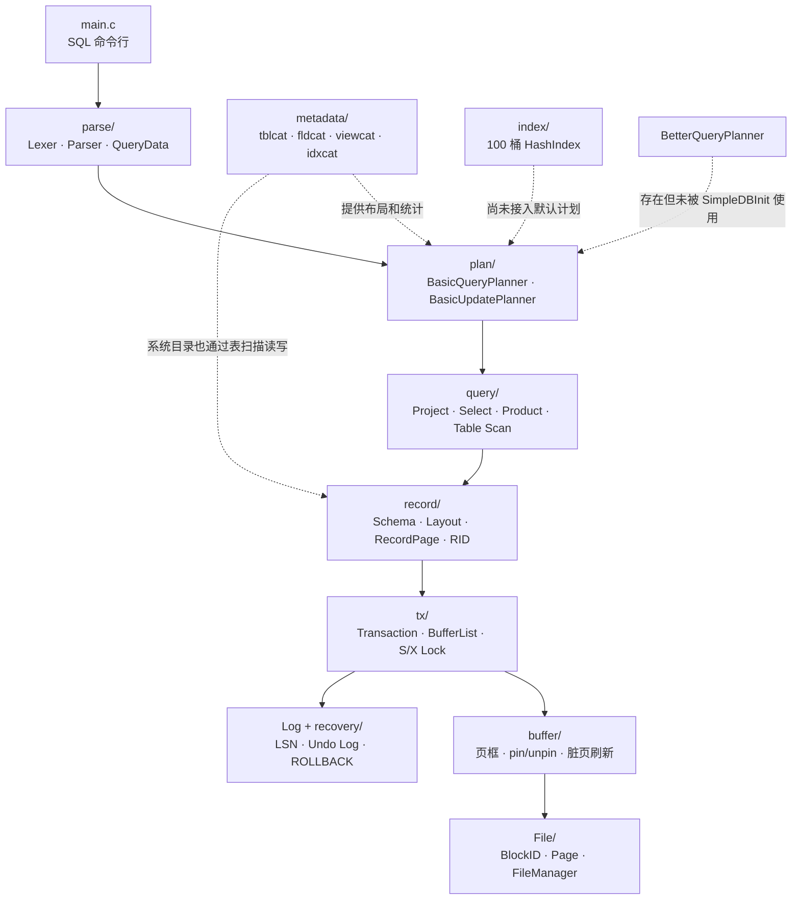

DBMS_C 是我的本科毕业设计，也是我第一次尝试把数据库课本里的概念接成一个真正能够运行的系统。

这个项目没有网络协议，没有用户权限，也不能和 MySQL、PostgreSQL 放在同一个标准下比较。它是一个教学型关系数据库原型：默认使用 4096 字节页面和 8 个缓冲帧，通过 C 语言实现了从 SQL 解析、查询计划和扫描执行，到记录页、事务、日志、缓冲池和文件读写的主链路。

我准备通过这个系列重新阅读它。目的不是把旧项目包装成“自研数据库”，而是回答更具体的问题：我到底实现了哪些机制；这些机制为什么这样组织；哪些代码只是实验；哪些 bug 改变了我对数据库内核的理解。

## 为什么还要重新写一遍

项目仓库已经有 README、设计文档和一套 13 章教程，但它们解决的问题与这个系列不同。

README 适合快速说明项目能做什么；教程适合顺着模块理解 API；这个系列更接近一次开发复盘。我会保留提交历史中的失败过程，也会主动指出文档中容易说大的地方。例如：项目有 `DeadlockDetector`，不代表死锁检测已经进入事务主流程；有 `HashIndex`，也不代表 SELECT 会自动选择索引；有 `TransactionRecover`，更不代表程序启动时已经完成崩溃恢复。

写这个系列时，我使用四类证据互相校验：

1. 当前源代码和 CMake 实际纳入的模块；
2. 2024 年 10 月到 2026 年 9 月之间的 65 次 Git 提交；
3. README、设计文档、发布记录和演示 SQL；
4. 全新副本中的构建、CTest 与命令行运行结果。

当文档和代码不一致时，以当前代码路径为准。

## 项目现在有多大

排除 `external/` 中的第三方代码后，仓库当前有约 1.37 万行非测试 C 源码，测试代码约 4800 行。CMake 注册了 25 个测试可执行文件，对应 105 个实际进入这些套件的 CMocka 用例。

我重新在 Windows 11、MinGW-w64 GCC 15.2.0 和 CMake 环境中做过一次全新构建，25 个 CTest 套件全部通过；随后实际运行了 `demo/demo.sql`，建表、插入、条件查询、多表查询、更新、删除、视图查询和显式提交都能走通。

这些数字只能说明项目主路径可以复现。并发测试没有制造真实的多线程竞争，恢复测试主要验证显式 rollback，哈希索引测试也没有覆盖完整的数据维护链。因此测试全绿不等于实现已经完整。

## 整体架构

下面这张图只画当前真实存在的调用方向。虚线模块虽然有代码或元数据，但并不一定进入默认查询路径。



这套分层最重要的不是目录名称，而是依赖方向。SQL 层不直接计算磁盘偏移，TableScan 不直接操作 `FILE *`，事务也不需要理解投影和谓词。一次读取最终会沿着 `Scan → TableScan → RecordPage → Transaction → Buffer → FileManager` 下沉；一次修改则会在这条路径旁边增加锁和 undo 日志。

装配入口集中在 `SimpleDBInit`。删去判空和初始化分支后，核心关系大致如下：

```c
simpleDB->fileManager = FileManagerInit(dbName, BLOCK_SIZE);
simpleDB->logManager = LogManagerInit(
    simpleDB->fileManager,
    CStringCreateFromCStr(LOG_FILE)
);
simpleDB->bufferManager = BufferManagerInit(
    simpleDB->fileManager,
    simpleDB->logManager,
    BUFFER_SIZE,
    replacementPolicy
);

Transaction *tx = SimpleDataNewTX(simpleDB);
simpleDB->metadataMgr = MetadataMgrInit(isNew, tx);
simpleDB->planer = PlannerInit(
    BasicQueryPlannerInit(simpleDB->metadataMgr),
    BasicUpdatePlannerInit(simpleDB->metadataMgr)
);
```

这段代码也暴露了当前边界：默认注入的是 `BasicQueryPlanner`，不是仓库中另外存在的 `BetterQueryPlanner`；初始化旧数据库时虽然会输出 `recovering existing database`，但没有调用 `TransactionRecover`。

## 当前真正完成了什么

### 已经走通的主路径

- `CREATE TABLE`、`INSERT`、`SELECT`、`UPDATE`、`DELETE`；
- `INT` 和 `VARCHAR(n)` 两种主要字段类型；
- 投影、AND 谓词和比较运算；
- 多表笛卡尔积加条件过滤；
- 视图定义保存与查询时递归展开；
- 固定大小页面、定长记录槽和跨块表扫描；
- Buffer pin/unpin、脏页刷新和日志先于数据页的写入顺序；
- 块级共享锁、排他锁和显式 `COMMIT` / `ROLLBACK`；
- 命令级 Trace，可以观察 QueryData、Plan 树和 Scan 链。

### 有实现，但没有完整接入

- `HashIndex` 可以表示桶和 RID 映射，但 `CREATE INDEX` 当前主要完成元数据登记；
- `BetterQueryPlanner` 有简单谓词分类和贪心连接顺序，默认数据库仍使用基础计划器；
- `DeadlockDetector` 有等待图和 DFS，锁管理器没有调用它；
- `TransactionRecover` 有扫描日志并撤销未完成事务的代码，启动路径没有执行它；
- LRU 链表和替换策略接口已经存在，但缓冲池当前优先线性选择第一个未固定帧，LRU 没有真正决定受害页。

### 明确没有实现

- 网络服务、协议和多客户端会话；
- 用户、权限和安全体系；
- 完整 SQL、NULL、约束、聚合、排序和子查询；
- 工业级崩溃恢复、检查点和并发调度；
- 索引自动维护与基于代价的默认执行计划；
- 完整跨平台支持，目前主要验证 Windows + MinGW。

## 这个系列会怎样展开

系列计划按照系统依赖逐层推进，但每篇文章都会围绕一次真实的设计或失败展开，而不是把源文件逐个翻译成中文。

1. [从数据库原理课到 1.3 万行 C：DBMS_C 是怎样开始的](./01-project-origin/)——项目动机、最初边界和三次明显的阶段变化。
2. [第一块数据怎样落盘：BlockID、Page 与 FileManager](./02-file-and-page/)——固定大小块、页内字节布局和文件刷新。
3. [内存中只有八个页框：DBMS_C 的 Buffer Pool 实现与失误](./03-buffer-pool/)——pin/unpin、对象身份 bug 与尚未闭环的 LRU。
4. [一条记录在页面里长什么样：Schema、Layout 与 RecordPage](./04-record-storage/)——固定记录槽、RID 与跨页 TableScan。
5. [一次修改怎样成为事务：DBMS_C 的 Transaction 实现](./05-transaction/)——BufferList、块级锁、日志和事务边界。
6. [ROLLBACK 为什么一直不对：Undo 日志与恢复机制复盘](./06-log-and-recovery/)——日志序列化、WAL 顺序、显式 undo 与崩溃恢复边界。
7. [数据库怎样认识自己的表：DBMS_C 的系统目录与自举](./07-metadata-bootstrap/)——四张目录表、首次启动和 Layout 重建。
8. [不做完整 SQL：我为 DBMS_C 写的 Lexer 与 Parser](./08-sql-parser/)——有限文法、QueryData、CommandData 与错误处理边界。
9. [一条 SELECT 如何走到磁盘：Plan、Scan 与执行链](./09-query-execution/)——基础计划树、多表 Product、更新路径和 Trace。
10. [有 S/X 锁，但还不是并发数据库：DBMS_C 的并发控制实验](./10-concurrency-control/)——锁表、升级、事务切换和死锁检测边界。
11. [写了哈希索引，却没有让查询用上它](./11-index-and-optimizer/)——桶文件、索引维护、统计估算和优化器实验。
12. [从“我的电脑能跑”到可复现构建：DBMS_C 的最后一公里](./12-testing-and-retrospective/)——测试、仓库清理、v1.0 发布与最终复盘。

后续文章不会假装我当时已经拥有成熟的数据库工程经验。恰恰相反，很多值得记录的内容来自最基础的问题：结构体应该保存对象还是指针，谁拥有一段内存，为什么写入文件后立即读回还是旧值，为什么一个函数存在却没有任何主流程调用它。

这也是我重新整理 DBMS_C 的原因。完成一个小数据库，并没有让我成为数据库专家；但它让我第一次能够顺着真实代码解释，一条 SQL 为什么最终会变成某个页面上某个偏移处的几组字节。

