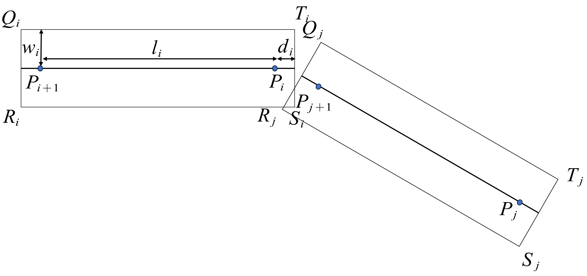
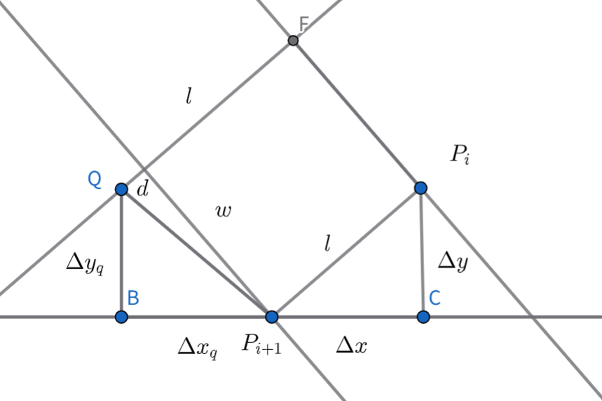

文件公式推导基于[2024全国大学生数学建模竞赛A题讲评：板凳龙闹元宵 - 2024数学建模赛题讲评 - 中国大学生在线](https://dxs.moe.gov.cn/zx/a/hd_sxjm_sxjmstjp_2024sxjmstjp/241202/1982935.shtml?source=hd_sxjm_sxjmstjp_2024sxjmstjp)

## 等距螺旋线

等距螺旋线应为:

$$
\rho = \frac{a}{2\pi}\theta+b
$$

本题中$b=0$,因此简化为:

$$
\rho=\frac{a}{2\pi}\theta
$$

对龙头进行讨论,记$t$时刻龙头极角为$\theta_{0}(t)$,则对$dl$和$d\theta$有:
(这是参数方程求距离,在高数上有此公式)

$$
\begin{aligned}

dl&=\sqrt{\rho(\theta)^2+\rho'(\theta)^2}d\theta\\
&=\sqrt{\frac{a^2}{4\pi^2}(\theta^2+1)}d\theta\\
&=\frac{a}{2\pi}\sqrt{\theta^2+1}d\theta
\end{aligned}
$$

对于dl和dt有:

$$
dl=0-v_{0}dt
$$

整理得:

$$
\begin{aligned}
\frac{a}{2\pi}\sqrt{\theta^2+1}d\theta&=-v_{0}dt\\
\frac{a}{2\pi}\int_{\theta_{0}(0)}^{\theta_{0}(t)}\sqrt{1+\theta^2}d\theta&=-v_{0}t
\end{aligned}
$$

对于$\int\sqrt{\theta^2+1}d\theta$有以下解法:

$$
\begin{aligned}
\theta &= tant\\
d\theta &= d(tant)\\
\int\sqrt{\theta^2+1}d\theta&=\int sectd(tant)\\
&=\int sec^3tdt
\\&=sect\cdot tant-\int tan^2t\cdot sectdt \\ &=sect\cdot tant-\int sec^3t-sectdt\\&=sect\cdot tant-\int sec^3tdt+\int sectdt
\\&=sect\cdot tant-\int sec^3tdt+\ln(sect+tant)\\
\int sec^3tdt &= \frac{1}{2}(sect \cdot tant +\ln(set+tant)) +C
\\&=\frac{1}{2}\theta\sqrt{1+\theta^2}+\frac{1}{2}\ln(\sqrt{\theta^2+1}+\theta)+c
\end{aligned}
$$

则,有

$$
\begin{aligned}
\frac{a}{2\pi}\int_{\theta_{0}(0)}^{\theta_{0}(t)}\sqrt{1+\theta^2}d\theta&=\frac{a}{2\pi}(
\frac{1}{2}(\theta_{0}(t)\sqrt{1+\theta_{0}(t)^2}+\frac{1}{2}\ln(\sqrt{\theta_{0}(t)^2+1}+\theta_{0}(t)))\\
&-\frac{a}{2\pi}(\frac{1}{2}\theta_{0}(0)\sqrt{1+\theta_{0}(0)^2}-\frac{1}{2}\ln(\sqrt{\theta_{0}(0)^2+1}+\theta_{0}(0)))\\&=-v_{0}t
\end{aligned}
$$

利用该公式可以求出每一个时刻$\theta_{0}$的极角.

对于第i条龙身的前把手，利用余弦定理有：

$$
(l_{i})^2 = \rho_{i+1}^2+\rho_{i}^2-2\rho_{i+1}\rho_{i}\cos(\theta_{i+1}-\theta_{i})
$$

即

$$
\begin{aligned}
(l_{i})^2 &= \rho_{i+1}^2+\rho_{i}^2-2\rho_{i+1}\rho_{i}\cos(\theta_{i+1}-\theta_{i})\\
&=\frac{a^2}{4\pi^2}[\theta_{i+1}^2+\theta{i}^2-2\theta_{i}\theta_{i+1}\cos(\theta_{i+1}-\theta{i})]
\end{aligned}
$$

根据每一个时刻可以求得龙头位置可以推导后面每一个结点的位置.

两侧同时对t求导得,

$$
\begin{aligned}
0 &= \frac{a^2}{4\pi^2}(2\theta_{i+1}\frac{d\theta_{i+1}}{dt}+2\theta_{i}\frac{d\theta_{i}}{dt}-2\theta_{i}\theta_{i+1}(-\sin(\theta_{i+1}-\theta{i})(\frac{d\theta_{i+1}}{t}-\frac{d\theta_{i}}{t}))\\&-2\cos(\theta_{i+1}-\theta_{i})(\theta_{i}\frac{d\theta_{i+1}}{t}+\theta_{i+1}\frac{d\theta_{i}}{t})
\end{aligned}
$$

将$\frac{d\theta_{i+1}}{t}$放在一起,$\frac{d\theta_{i}}{t}$放在一起有(已经约去系数)

$$
\begin{aligned}
&\frac{d\theta_{i+1}}{dt}(\theta_{i+1}+\theta_{i}\theta_{i+1}\sin(\theta_{i+1}-\theta_{i})-\theta_{i}\cos(\theta_{i+1}-\theta_{i}))
\\&+\frac{d\theta_{i}}{dt}(
\theta_{i}-\theta_{i}\theta_{i+1}\sin(\theta_{i+1}-\theta_{i})-\theta_{i+1}\cos(\theta_{i+1}-\theta{i}))=0
\end{aligned}
$$

化简得:

$$
\begin{aligned}
\frac{d\theta_{i+1}}{dt}=\frac{\theta_{i}-\theta_{i}\theta_{i+1}\sin(\theta_{i+1}-\theta_{i})-\theta_{i+1}\cos(\theta_{i+1}-\theta{i})}{-\theta_{i+1}-\theta_{i}\theta_{i+1}\sin(\theta_{i+1}-\theta_{i})+\theta_{i}\cos(\theta_{i+1}-\theta_{i})}\frac{d\theta_{i}}{dt}
\end{aligned}
$$

去一小段$dt$ 则第i个龙身前把手其运动路径有

$$
\begin{aligned}
dl &= v_{i}dt\\
dl&=\sqrt{\rho(\theta_{i})^2+\rho'(\theta_{i})^2}d\theta_{i}\\
&=\sqrt{\frac{a^2}{4\pi^2}(\theta^2+1)}d\theta_{i}\\
&=\frac{a}{2\pi}\sqrt{\theta_{i}^2+1}d\theta_{i}\\
\left|v_{i} \right|&= \frac{a}{2\pi}\sqrt{\theta_{i}^2+1}\left|\frac{d\theta_{i}}{dt}\right|
\end{aligned}
$$

因此第$i+1$个速度为

$$
\left| v_{i+1} \right|=\frac{\left |\theta_{i}-\theta_{i}\theta_{i+1}\sin(\theta_{i+1}-\theta_{i})-\theta_{i+1}\cos(\theta_{i+1}-\theta{i})\right|}{\left|-\theta_{i+1}-\theta_{i}\theta_{i+1}\sin(\theta_{i+1}-\theta_{i})+\theta_{i}\cos(\theta_{i+1}-\theta_{i})\right|} \sqrt{\frac{1+\theta_{i+1}^2}{1+\theta_{i}^2}} \left| v_{i}\right|
$$

## 碰撞模型

碰撞时示意图如下所示

则可以将QTSR的坐标表示出来

首先是Q，有示意图如下：

设$\alpha ,\beta, \theta$有

$$
\begin{aligned}
\tan\alpha &= \dfrac{d}{w} \\
\tan\theta &= \dfrac{\Delta y_q}{\Delta x_q} \\
\tan\beta  &= \dfrac{\Delta y}{\Delta x}\\
r^2 &= d^2+w^2\\
xi-x_{i+1} &= \Delta x\\
x_{i+1}- x_q&=\Delta x_q\\
\end{aligned}
$$

可以推导出：

$$
\begin{aligned}
\Delta y^2+\Delta x^2&=l^2 \\
d^2+w^2&=\Delta x_{q}^2+\Delta y_{q}^2 \\
\tan\alpha &= \dfrac{d}{w} \\
\tan\theta &= \dfrac{\Delta y_q}{\Delta x_q} \\
\tan\beta  &= \dfrac{\Delta y}{\Delta x} \\
\alpha + \beta +\theta &= \frac{\pi}{2}\\
\sin(\alpha+\beta)&=\sin\alpha \cos\beta+\sin\beta \cos\alpha\\
&=\frac{d\Delta x+w\Delta y}{rl}\\
\cos(\alpha+\beta)&=\cos\alpha \cos\beta-\sin\beta \sin\alpha\\
&=\frac{w\Delta x-d\Delta y}{rl}\\
\Delta x_q &= r\cos\theta\\
&=r\cos(\frac{\pi}{2}-(\alpha + \beta))\\
&=r\sin(\alpha+\beta)\\
&=\frac{d\Delta x+w\Delta y}{l}\\
x_{i+1}-x_q&=\frac{d(x_i-x_{i+1})+w(y_i-y_{i+1})}{l}\\
x_q&=x_{i+1}-\frac{d(x_i-x_{i+1})+w(y_i-y_{i+1})}{l}\\
&=\frac{(l+d)x_{i+1}-dx_{i}+w(y_{i+1}-y_{i})}{l}\\
&=\frac{(l+d)x_{i+1}-(l+d)x_{i}+w(y_{i+1}-y_{i})+lx_{i}}{l}\\
&=x_{i}+\frac{(l+d)x_{i+1}-(l+d)x_{i}+w(y_{i+1}-y_{i})}{l}\\
\Delta q &= r\sin\theta\\
&=\frac{w\Delta x-d\Delta y}{l}\\
y_{i+1}-y_{q} &=\frac{w(xi-x_{i+1})-d(yi-y_{i+1})}{l}\\

\end{aligned}
$$

其他部分以后有时间再写吧~
